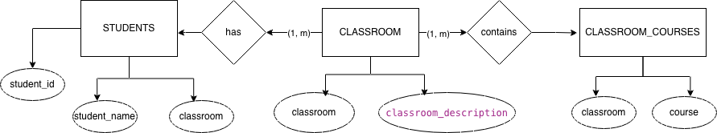

# Factoria F5 Exercise - DB Normalization - Students-Classrooms-Courses 

## Description
Goal: Normalize this database to 3nf level of normalization. 

## Diagram de Chen (ER)

## Diagram Crow's Feet with UML (ER)

## Finalized database (3nf)

